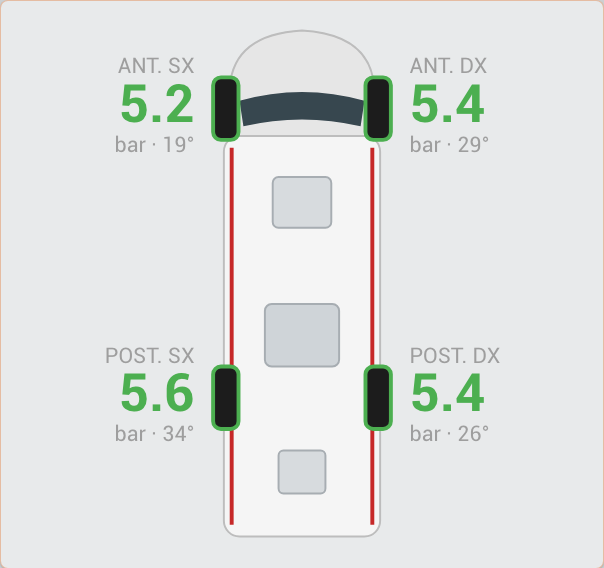
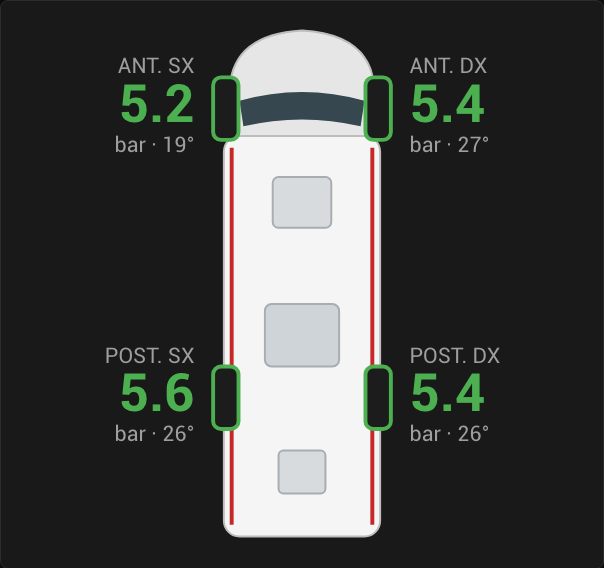

# USB TPMS dongle → Home Assistant

Read the cheap **"USB TPMS for Android"** tyre pressure kits (4 valve-cap sensors at **433 MHz** + a small USB receiver) directly in **Home Assistant**, without the Android app. A tiny add-on reads the dongle and publishes pressure and temperature of every wheel over MQTT. No cloud, no app, standard library Python only.

| Light theme | Dark theme |
|---|---|
|  |  |

*The included tyre card on the author's head unit (labels in Italian there; the card in this repo uses FRONT L / FRONT R / REAR L / REAR R).*

> ⚠️ Read the [disclaimer](#disclaimer) before relying on this for anything.

---

## Contents

- [Hardware](#hardware)
- [How it works](#how-it-works)
- [Install](#install)
- [Home Assistant](#home-assistant)
- [Protocol](#protocol)
- [Gotchas](#gotchas)
- [Tested on](#tested-on)
- [Disclaimer](#disclaimer)
- [How this was made](#how-this-was-made)

## Hardware

The generic kit sold on AliExpress and similar shops as **"USB TPMS for Android"** / "Android TPMS" for car head units:

- 4 external sensors that screw onto the valves, **433 MHz** (not Bluetooth);
- a USB receiver, which is a **CH340 USB-serial chip** (`VID:PID 1a86:7523`) with the radio behind it.

Normally the dongle goes into the Android head unit and a "TPMS" app reads it. Here it goes into the machine running Home Assistant instead. Check with `lsusb`: if you see `1a86:7523 QinHeng Electronics CH340 serial converter`, this is very likely the same kit.

The kit here came with the sensors already paired. After moving the dongle from the head unit to Home Assistant all 4 sensors kept working, with no pairing step.

## How it works

```
sensors ~433 MHz~> USB dongle (CH340, 19200 8N1) -> add-on (tpms.py) -> MQTT tpms/state -> HA sensors
```

The add-on finds the dongle by its USB id, decodes the serial frames and publishes one retained JSON message on `tpms/state` whenever a value changes, and at least every 60 s:

```json
{"front_left": {"bar": 5.23, "status": 0, "temp": 19},
 "front_right": {"bar": 5.09, "status": 0, "temp": 18},
 "rear_left": {"bar": 5.16, "status": 0, "temp": 17},
 "rear_right": {"bar": 5.02, "status": 0, "temp": 17},
 "spare": {"bar": 2.51, "status": 0, "temp": 33}}
```

## Install

Requirements: Home Assistant OS or Supervised, with an MQTT broker (the **Mosquitto** add-on) and the MQTT integration set up.

1. Plug the dongle into the Home Assistant machine.
2. **Settings → Add-ons → Add-on store → ⋮ → Repositories**, add `https://github.com/danderik88/usb-tpms-home-assistant`.
3. Install **USB TPMS**, start it, turn on *Start on boot*. The add-on builds locally on first install (a couple of minutes on a Raspberry Pi).

> On the author's system the same files run as a **local add-on** (copied into `/addons/tpms_usb`), which also works if you prefer not to add the repository.
4. Check with *MQTT → Listen to a topic* on `tpms/state`, or in the add-on log (it only logs errors).

No configuration: the MQTT credentials come from the Mosquitto add-on automatically.

Without the add-on system (plain Docker / Linux), `tpms_usb/tpms.py` works on its own: it prints the JSON lines on stdout, so `python3 tpms.py | mosquitto_pub -r -l -t tpms/state ...` does the same job. `python3 tpms.py demo` runs its self-test.

## Home Assistant

All in [`homeassistant/`](homeassistant):

| File | What |
|---|---|
| [`mqtt_tpms.yaml`](homeassistant/mqtt_tpms.yaml) | 8 MQTT sensors: `sensor.tpms_<wheel>_pressure` (bar, with `bar`/`temp`/`status` attributes) and `sensor.tpms_<wheel>_temperature` (°C) |
| [`automation_tpms_alarm.yaml`](homeassistant/automation_tpms_alarm.yaml) | Alarm on low / high pressure or hot tyre, held for 1 min. Thresholds are the author's motorhome values: set your own |
| [`tyre_card.yaml`](homeassistant/tyre_card.yaml) | The card in the screenshots: vehicle seen from above, green / red per wheel, grey when no data. Needs [button-card](https://github.com/custom-cards/button-card) |

The spare slot is left out of the sensors on purpose (see below): add it the same way if you have a fifth sensor.

**Alarm on an Android head unit (Home Assistant companion app).** Tested on an ATOTO A5L:

- a notification on its own `channel` with `importance: high` shows as a **heads-up banner** over any app, and with `sticky` it stays until tapped. This is what the example uses;
- a spoken alert (`message: TTS`) works, but on this head unit the volume stays **low whatever you do** (ring volume, navi gain, `alarm_stream_max`, `music_stream`, `command_volume_level` changed nothing). Do not count on it being heard while driving.

## Protocol

Serial **19200 8N1**. The dongle sends 8-byte frames:

| Byte | 0 | 1 | 2 | 3 | 4 | 5 | 6 | 7 |
|---|---|---|---|---|---|---|---|---|
| | `55` | `AA` | `08` | position | pressure | temperature | status | XOR of bytes 0-6 |

- **pressure** = byte × 3.44 kPa → `bar = byte × 3.44 / 100`
- **temperature** = byte − 50 °C
- **position**, each one verified by unscrewing that sensor and watching it drop to 0:

| Byte | Wheel |
|---|---|
| `00` | front left |
| `01` | front right |
| `10` | rear left |
| `11` | rear right |
| `05` | spare slot |

- **status**: `0` in normal use. `8` was seen on two wheels while air was escaping (sensor just screwed back on), then went back to `0`. Other values and their meaning are unknown, so the examples do not use it.

## Gotchas

- **A dead sensor is invisible.** The dongle keeps repeating the last value it received for every position, forever. A sensor with a flat battery keeps showing its last pressure. The MQTT sensors only go `unavailable` if the dongle or the add-on stops.
- **Parked, sensors transmit rarely.** Front wheels updated 10-20 s after a change, one rear wheel took about **7 minutes**.
- **The spare slot (`05`) reports a fixed value** (2.51 bar / 33 °C here) even with no fifth sensor installed. That is why it is not in the sensors.
- **Unscrewing a sensor loses some air.** On the rear wheels each test unscrew cost 0.3-0.4 bar: check the pressure afterwards.
- **Only one reader at a time.** Unplug the dongle from the head unit: the Android app and this add-on cannot share it.

## Tested on

| | |
|---|---|
| Home Assistant | HAOS on a Raspberry Pi (aarch64), Mosquitto add-on |
| Kit | "USB TPMS for Android", 4 external sensors, CH340 receiver `1a86:7523` |
| Vehicle | Fiat Ducato X250 motorhome, cold pressures 5.0-5.6 bar |
| Head unit for alerts | ATOTO A5L (Android 9), Home Assistant companion app |

The add-on is only declared for `aarch64` because that is the only architecture it was tested on. The code has no architecture-specific parts, so other boards should work by adding them to `arch` in `tpms_usb/config.yaml` and changing the base image in the `Dockerfile`. Reports welcome.

## Disclaimer

This is a **hobby project**, shared for information only, with **no warranty of any kind** (see [LICENSE](LICENSE)).

- A TPMS reading shown in Home Assistant is **not a safety system**. Values can be stale (see [Gotchas](#gotchas)), the alarm can fail silently, and notifications can arrive late or not at all. Keep checking your tyres with a gauge, and never let a dashboard distract you while driving.
- The protocol and wheel mapping come from **one kit**; yours may differ.
- The author accepts **no liability** for any damage to vehicles, equipment, data or people.
- Home Assistant, ATOTO, Fiat, Ducato and Elnagh are trademarks of their respective owners. This project is **not affiliated** with or endorsed by any of them.

## How this was made

This project was done together with an AI coding agent ([Claude Code](https://claude.com/claude-code) by Anthropic). The agent read the dongle, worked out the frame format, wrote the add-on, the Home Assistant configuration and the card, and drafted this documentation.

Every wheel position was checked by hand on the real vehicle, unscrewing one sensor at a time. Anything not confirmed that way is left out or marked as unknown. If you find a mistake, please [open an issue](../../issues).

## License

[MIT](LICENSE)
